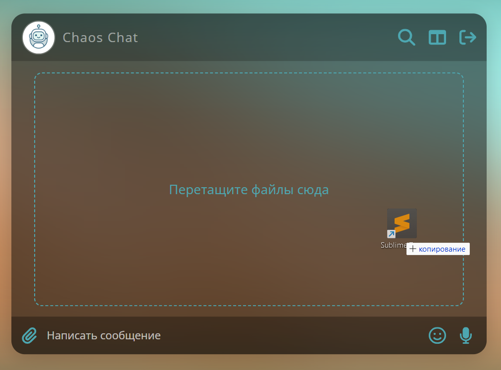

# Chaos Chat

Приложение предоставляет следующие функции:

1. **Сохранение в истории ссылок и текстовых сообщений**: Чат сохраняет все отправленные текстовые сообщения и ссылки в истории чата.
2. **Кликабельные ссылки**: Все ссылки (начинающиеся с http:// или https://) в текстовых сообщениях автоматически становятся кликабельными и отображаются как гиперссылки.
3. **Сохранение изображений, видео и аудио**: Файлы можно отправлять через Drag & Drop или через иконку загрузки. Поддерживаются изображения, видео и аудио файлы. 
4. **Скачивание файлов на компьютер пользователя**: Вложения можно скачать на свой компьютер.
5. **Ленивая подгрузка**: Сначала подгружаются последние 10 сообщений, при прокрутке вверх подгружаются следующие 10 и т. д.
6. **Запись аудио**: Пользователи могут записывать аудио-сообщения и отправлять их в чат.  
7. **Просмотр вложений по категориям**: Вложения можно просмотреть, отсортированные по категориям: аудио, видео, изображения, другие файлы. 
8. **Поддержка emoji**: Чат поддерживает использование emoji в текстовых сообщениях. 

